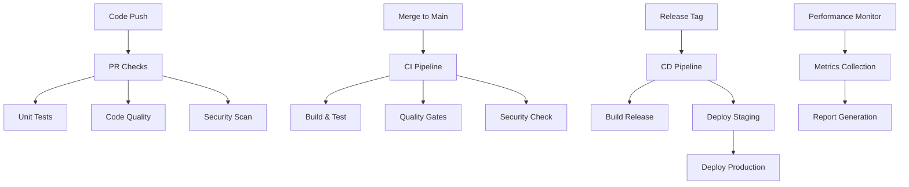

# 🚀 EarthMAX Android CI/CD Pipeline

This document describes the complete CI/CD pipeline setup for the EarthMAX Android application, including automated testing, code quality checks, security scanning, and deployment processes.

## 📋 Table of Contents

- [Overview](#overview)
- [Pipeline Architecture](#pipeline-architecture)
- [Setup Instructions](#setup-instructions)
- [Workflows](#workflows)
- [Scripts](#scripts)
- [Configuration](#configuration)
- [Environment Variables](#environment-variables)
- [Monitoring](#monitoring)
- [Troubleshooting](#troubleshooting)

## 🎯 Overview

The EarthMAX CI/CD pipeline provides:

- **Automated Testing**: Unit tests, integration tests, and UI tests
- **Code Quality**: Static analysis with Detekt, Ktlint, and SonarCloud
- **Security Scanning**: Dependency vulnerability checks with OWASP and Trivy
- **Performance Monitoring**: Build time, APK size, and memory usage tracking
- **Automated Deployment**: Staging and production deployments
- **Notifications**: Slack integration for build status updates

## 🏗️ Pipeline Architecture



## 🛠️ Setup Instructions

### 1. Initial Setup

Run the setup script to configure your CI/CD environment:

```bash
./scripts/setup-ci.sh setup
```

This will:
- Create necessary directories
- Generate debug keystore
- Set up Git hooks
- Configure IDE settings
- Validate Gradle wrapper

### 2. Environment Configuration

Set up the following environment variables in your CI/CD system:

#### Required for All Environments
```bash
# Keystore Configuration
KEYSTORE_PASSWORD="your_keystore_password"
KEY_ALIAS="earthmax"
KEY_PASSWORD="your_key_password"

# GitHub
GITHUB_TOKEN="your_github_token"
GITHUB_REPOSITORY="your_username/earthmax"
```

#### Firebase App Distribution
```bash
FIREBASE_APP_ID="your_firebase_app_id"
FIREBASE_TOKEN="your_firebase_token"
```

#### Google Play Console
```bash
GOOGLE_PLAY_SERVICE_ACCOUNT_JSON="service_account_json_content"
```

#### SonarCloud
```bash
SONAR_TOKEN="your_sonar_token"
SONAR_HOST_URL="https://sonarcloud.io"
```

#### Slack Notifications
```bash
SLACK_WEBHOOK_URL="your_slack_webhook_url"
```

### 3. Keystore Setup

Generate your release keystore:

```bash
keytool -genkey -v -keystore keystore/release.keystore -alias earthmax -keyalg RSA -keysize 2048 -validity 10000
```

Upload the keystore file to your CI/CD system's secure file storage.

## 🔄 Workflows

### 1. Continuous Integration (`ci.yml`)

**Triggers**: Push and PR to `main` and `develop` branches

**Jobs**:
- **test-and-quality**: Runs unit tests and code quality checks
- **security-scan**: Performs security vulnerability scanning
- **build**: Builds debug APK and runs additional validations
- **sonarcloud**: Analyzes code quality with SonarCloud

### 2. Continuous Deployment (`cd.yml`)

**Triggers**: Release tags (`v*`)

**Jobs**:
- **deploy-staging**: Deploys to staging environment
- **deploy-production**: Deploys to production (requires manual approval)
- **rollback**: Handles production rollbacks if needed

### 3. Pull Request Checks (`pr-checks.yml`)

**Triggers**: Pull requests

**Jobs**:
- **validate-pr**: Validates PR title and checks for breaking changes
- **code-review**: Automated code review with detailed analysis
- **security-check**: Dependency security validation
- **test-coverage**: Analyzes test coverage and reports

### 4. Performance Monitoring (`performance-monitoring.yml`)

**Triggers**: Scheduled (daily) and manual

**Jobs**:
- **build-performance**: Measures build times and APK sizes
- **memory-analysis**: Analyzes memory usage and method counts
- **dependency-analysis**: Checks for outdated and vulnerable dependencies
- **generate-report**: Creates comprehensive performance reports

## 📜 Scripts

### 1. Setup Script (`setup-ci.sh`)

Configures the CI/CD environment:

```bash
./scripts/setup-ci.sh setup     # Complete setup
./scripts/setup-ci.sh hooks     # Git hooks only
./scripts/setup-ci.sh keystore  # Debug keystore only
./scripts/setup-ci.sh build     # Test build only
```

### 2. Deployment Script (`deploy.sh`)

Handles deployment processes:

```bash
./scripts/deploy.sh test                    # Run tests
./scripts/deploy.sh build debug             # Build debug APK
./scripts/deploy.sh deploy staging 1.0.0    # Deploy to staging
./scripts/deploy.sh deploy production 1.0.0 # Deploy to production
```

### 3. Performance Monitor (`performance-monitor.sh`)

Monitors app performance:

```bash
./scripts/performance-monitor.sh build              # Build performance
./scripts/performance-monitor.sh memory             # Memory analysis
./scripts/performance-monitor.sh dependencies       # Dependency analysis
./scripts/performance-monitor.sh generate-baseline  # Create baseline
./scripts/performance-monitor.sh compare            # Compare with baseline
./scripts/performance-monitor.sh report             # Generate HTML report
./scripts/performance-monitor.sh all                # Run all checks
```

## ⚙️ Configuration

### 1. Code Quality Tools

#### Detekt (`config/detekt/detekt.yml`)
- Static code analysis for Kotlin
- Custom rules for Android development
- Complexity and style checks

#### Ktlint (`config/ktlint/.editorconfig`)
- Code formatting standards
- Consistent style across the project
- Integration with IDE

#### SonarCloud (`sonar-project.properties`)
- Code quality and security analysis
- Technical debt tracking
- Coverage reports

### 2. Security Tools

#### OWASP Dependency Check (`config/owasp/suppressions.xml`)
- Vulnerability scanning for dependencies
- False positive suppressions
- Regular security updates

#### Trivy
- Container and filesystem scanning
- License compliance checking
- Misconfiguration detection

### 3. Build Configuration

#### Gradle Plugins
- Jacoco for test coverage
- Detekt for static analysis
- Ktlint for code formatting
- OWASP for security scanning
- SonarQube for quality analysis

## 🔐 Environment Variables

### GitHub Actions Secrets

Set these secrets in your GitHub repository settings:

| Secret Name | Description | Required For |
|-------------|-------------|--------------|
| `KEYSTORE_PASSWORD` | Keystore password | Release builds |
| `KEY_ALIAS` | Key alias in keystore | Release builds |
| `KEY_PASSWORD` | Key password | Release builds |
| `FIREBASE_TOKEN` | Firebase CLI token | App Distribution |
| `FIREBASE_APP_ID` | Firebase App ID | App Distribution |
| `GOOGLE_PLAY_SERVICE_ACCOUNT_JSON` | Service account JSON | Play Store |
| `SONAR_TOKEN` | SonarCloud token | Code analysis |
| `SLACK_WEBHOOK_URL` | Slack webhook | Notifications |
| `GITHUB_TOKEN` | GitHub token | Releases |

### Local Development

For local development, create a `.env` file (not committed):

```bash
# Local environment variables
KEYSTORE_PASSWORD=debug_password
KEY_ALIAS=androiddebugkey
KEY_PASSWORD=debug_password
```

## 📊 Monitoring

### 1. Performance Metrics

The pipeline tracks:
- **Build Times**: Debug and release build durations
- **APK Sizes**: Size optimization tracking
- **Method Count**: DEX method limit monitoring
- **Memory Usage**: Heap and memory leak detection
- **Dependencies**: Update and security status

### 2. Quality Metrics

Monitored through SonarCloud:
- **Code Coverage**: Test coverage percentage
- **Technical Debt**: Code maintainability issues
- **Security Hotspots**: Potential security vulnerabilities
- **Code Smells**: Code quality issues
- **Duplications**: Code duplication percentage

### 3. Reports

Generated reports include:
- **Performance Reports**: HTML dashboards with metrics
- **Test Coverage**: Jacoco coverage reports
- **Security Scans**: OWASP and Trivy vulnerability reports
- **Code Quality**: SonarCloud analysis reports
- **Dependency Updates**: Available updates and security patches

## 🔧 Troubleshooting

### Common Issues

#### 1. Build Failures

**Symptom**: Build fails in CI but works locally
**Solution**:
```bash
# Clean and rebuild
./gradlew clean
./gradlew build

# Check Gradle wrapper
./gradlew wrapper --gradle-version 8.4
```

#### 2. Test Failures

**Symptom**: Tests pass locally but fail in CI
**Solution**:
```bash
# Run tests with same environment
./gradlew testDebugUnitTest --info
./gradlew connectedDebugAndroidTest
```

#### 3. Code Quality Issues

**Symptom**: Detekt or Ktlint failures
**Solution**:
```bash
# Auto-fix formatting
./gradlew ktlintFormat

# Check Detekt issues
./gradlew detekt
```

#### 4. Security Scan Issues

**Symptom**: OWASP dependency check failures
**Solution**:
```bash
# Update suppressions
vim config/owasp/suppressions.xml

# Update dependencies
./gradlew dependencyUpdates
```

### Debug Commands

```bash
# Check CI setup
./scripts/setup-ci.sh build

# Test deployment script
./scripts/deploy.sh test

# Generate performance baseline
./scripts/performance-monitor.sh generate-baseline

# Clean old reports
./scripts/performance-monitor.sh clean
```

### Getting Help

1. **Check Logs**: Review GitHub Actions logs for detailed error messages
2. **Local Testing**: Run the same commands locally to reproduce issues
3. **Documentation**: Refer to tool-specific documentation
4. **Community**: Check GitHub issues and Stack Overflow

## 📈 Performance Optimization

### Build Optimization

1. **Gradle Daemon**: Enable for faster builds
2. **Parallel Execution**: Use `--parallel` flag
3. **Build Cache**: Enable Gradle build cache
4. **Incremental Builds**: Avoid clean builds when possible

### CI/CD Optimization

1. **Caching**: Cache Gradle dependencies and build outputs
2. **Parallel Jobs**: Run independent jobs in parallel
3. **Conditional Execution**: Skip unnecessary steps
4. **Resource Allocation**: Use appropriate runner sizes

## 🚀 Future Enhancements

- **UI Testing**: Add Espresso and UI Automator tests
- **Performance Testing**: Integrate performance benchmarking
- **A/B Testing**: Add feature flag management
- **Crash Reporting**: Integrate crash analytics
- **Analytics**: Add user behavior tracking
- **Monitoring**: Add APM and error tracking

---

## 📞 Support

For questions or issues with the CI/CD pipeline:

1. Check this documentation
2. Review GitHub Actions logs
3. Test locally with provided scripts
4. Create an issue in the repository

**Happy Building! 🌍**